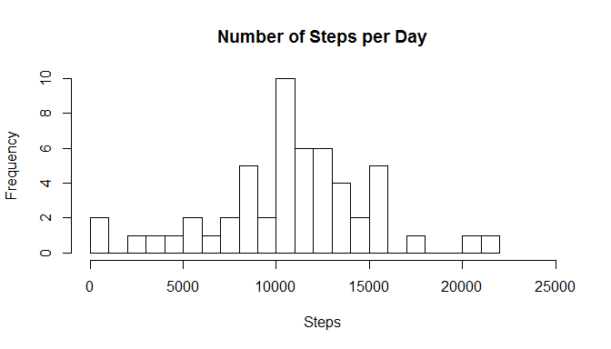
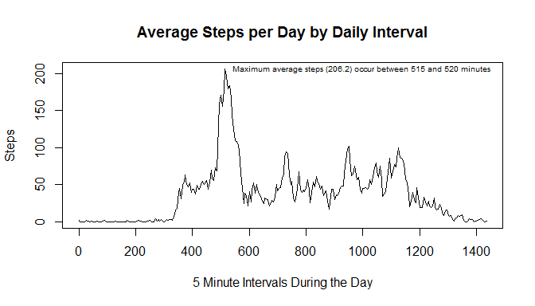
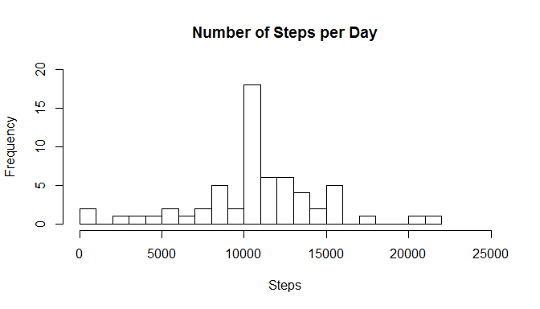
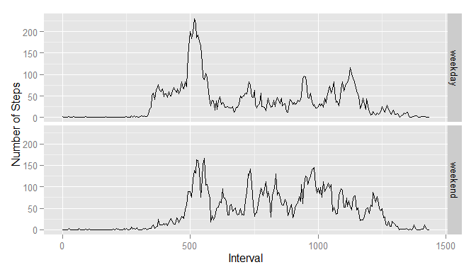

# Reproducible Research: Peer Assessment 1
Wayne Carriker

May 10, 2015

## Loading and preprocessing the data

The first step in this assignment is to unzip the data file and load the data.
This is easily achieved as shown:


```r
unzip("activity.zip")
datatypes <- c("integer", "Date", "integer")
data <- read.csv("activity.csv", na.strings = "NA", colClasses = datatypes)
```


This produces a new data frame called 'data' containing 17568
observations of 3 variables with the number of steps taken, the date,
and the time interval. The summary of this data frame is shown below:


```r
summary(data)
```

```
##      steps             date               interval     
##  Min.   :  0.00   Min.   :2012-10-01   Min.   :   0.0  
##  1st Qu.:  0.00   1st Qu.:2012-10-16   1st Qu.: 588.8  
##  Median :  0.00   Median :2012-10-31   Median :1177.5  
##  Mean   : 37.38   Mean   :2012-10-31   Mean   :1177.5  
##  3rd Qu.: 12.00   3rd Qu.:2012-11-15   3rd Qu.:1766.2  
##  Max.   :806.00   Max.   :2012-11-30   Max.   :2355.0  
##  NA's   :2304
```


## What is mean total number of steps taken per day?

To look at the mean total number of steps taken per day, the first step is to
remove any missing data to simplify all the calculations. This is also easy to
do as follows:


```r
missingsteps <- is.na(data$steps)
cleandata <- data[!missingsteps,]
```


This eliminates 2304 missing values, leaving 15264 observations.
And it is then easy to calculate the number of steps taken per day, plot a 
histogram showing the frequency with which a range of steps was achieved each
day, and calculate several "interesting" values including: the minimum number of
steps, the mean number of steps, the median number of steps, and the maximum
number of steps taken per day.


```r
steps <- tapply(cleandata$steps, cleandata$date, sum)
minsteps <- min(steps)
meansteps <- mean(steps)
mediansteps <- median(steps)
maxsteps <- max(steps)
title <- "Number of Steps per Day"
hist(steps, main = title, xlab = "Steps", breaks = 25, xlim = c(0, 25000))
```

 

- The minimum number of steps taken in any day was 41.
- The mean number of steps taken each day was 10766.2.
- The median number of steps taken across the days was 10765.
- The maximum number of steps taken in any day was 21194.

## What is the average daily activity pattern?

Understanding the average daily activity pattern is another easy calculation
and can be illustrated with a simple time series plot as follows:


```r
steps2 <- tapply(cleandata$steps, cleandata$interval, mean)
maxsteps2 <- max(steps2)
when <- which.max(steps2)
psteps <- as.data.frame(steps2)
psteps$interval <- seq(0, 1435, by = 5)
title <- "Average Steps per Day by Daily Interval"
xlabel <- "5 Minute Intervals During the Day"
plot(psteps$interval, psteps$steps, type = "l", 
     main = title, xlab = xlabel, ylab = "Steps")
label <- sprintf("Maximum average steps (%.1f) occur between %d and %d minutes",
                 maxsteps2, psteps$interval[when], psteps$interval[when+1])
text(psteps$interva[when], maxsteps2, pos = 4, cex = 0.6, label)
```

 

## Imputing missing values

As noted earlier, there are 2304 missing data values in this data set.
This represents 13.1% of the original
data.

One simple way to "fill in" this missing data is to take the average value for
each 5 minute interval, round this to an integer number, and use this to back
fill for any missing value.


```r
filleddata <- data
filleddata$steps2 <- as.integer(round(psteps$steps, digits = 0))
filleddata$steps[is.na(data$steps)] <- filleddata$steps2[is.na(data$steps)]
steps3 <- tapply(filleddata$steps, filleddata$date, sum)
meansteps3 <- mean(steps3)
mediansteps3 <- median(steps3)
title <- "Number of Steps per Day"
hist(steps3, main = title, xlab = "Steps", breaks = 25, 
     xlim = c(0, 25000), ylim = c(0,20))
```

 

- The new mean number of steps taken each day was 
10765.6 (versus 10766.2 before.)
- The new median number of steps taken across the days was 10762
(versus 10765 before.)

These represent a negligible change in the mean and median values.

## Are there differences in activity patterns between weekdays and weekends?

Finally, to look at the data and determine if there are differences between
week days and weekend days requires a few more simple adjustments to the data.
Continuing from the prior example, this one starts with the filled in steps
values rather than the missing values. This may not make sense as the filled
in values simply use averages across all days and thus may mask differences
between week days and weekend days, but using the filled in data is part of the
assignment...


```r
library(ggplot2)
```

```
## Warning: package 'ggplot2' was built under R version 3.1.3
```

```r
fdata <- filleddata
fdata$day <- weekdays(fdata$date)
fdata$day[(fdata$day == "Saturday") | (fdata$day == "Sunday")] <- "weekend"
fdata$day[fdata$day != "weekend"] <- "weekday"
fdata$day <- as.factor(fdata$day)
wddata <- fdata[fdata$day == "weekday",]
wedata <- fdata[fdata$day == "weekend",]
wdsteps <- tapply(wddata$steps, wddata$interval, mean)
westeps <- tapply(wedata$steps, wedata$interval, mean)
psteps2 <- as.data.frame(wdsteps)
names(psteps2)[names(psteps2) == "wdsteps"] <- "steps"
psteps2$interval <- seq(0, 1435, by = 5)
psteps2$day <- "weekday"
psteps3 <- as.data.frame(westeps)
names(psteps3)[names(psteps3) == "westeps"] <- "steps"
psteps3$interval <- seq(0, 1435, by = 5)
psteps3$day <- "weekend"
pstepsf <- rbind(psteps2, psteps3)
qplot(interval, steps, data = pstepsf, facets = day ~ ., geom = "line",
      xlab = "Interval", ylab = "Number of Steps")
```

 

While this plot does not have exactly the same format as the sample plot (the
background is gray and the headings are on the side), it does clearly illustrate
that there is a different pattern of steps taken throughout the day between
week days and weekend days.
